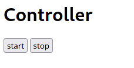

### 3
Shell 1 (mqtt broker):
```
cd src/node_broker
npm i
npm start
```
Shell 2 (REST):
```
cd http
npm i
start
```
Shell 3 (mqtt subscriber):
```
mqtt-cli localhost coordinates hello -w
```
Shell 4 (mqtt publisher aka opencv):
```
docker build . -t grillow1337/3
xhost +
docker run -it --rm -e DISPLAY -v /tmp/.X11-unix/:/tmp/.X11-unix --net=host --device /dev/snd grillow1337/3
xhost -
```
Shell 5 (REST client):
```
curl --header "Content-Type: application/json" --request POST --data '{"action":"start"}' http://localhost:8080
curl --header "Content-Type: application/json" --request POST --data '{"action":"stop"}' http://localhost:8080
```
or<br/>
http://localhost:8080 in browser<br/>


##### P.S.
IPC между нодой (REST) и opencv реализовано через TCP сокет. Реализовал бы через pipe, если бы узнал о том, что нода его поддерживает, раньше.
