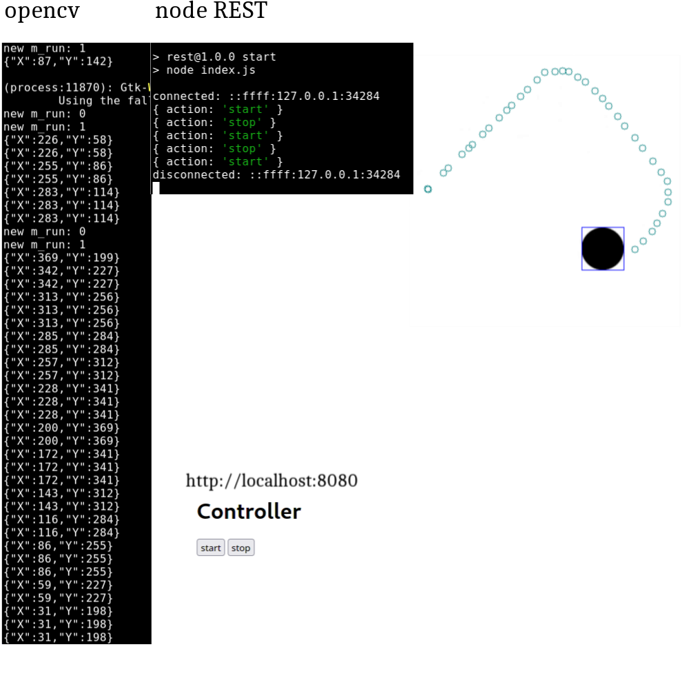

### 3
Shell 1:
```
cd src/node_broker
npm i
npm start
```
Shell 2:
```
mqtt-cli localhost coordinates hello -w
```
Shell 3:
```
docker build . -t grillow1337/3
xhost +
docker run -it --rm -e DISPLAY -v /tmp/.X11-unix/:/tmp/.X11-unix --net=host --device /dev/snd grillow1337/3
xhost -
```
Shell 4:
```
curl --header "Content-Type: application/json" --request POST --data '{"action":"start"}' http://localhost:8080
curl --header "Content-Type: application/json" --request POST --data '{"action":"stop"}' http://localhost:8080
```

